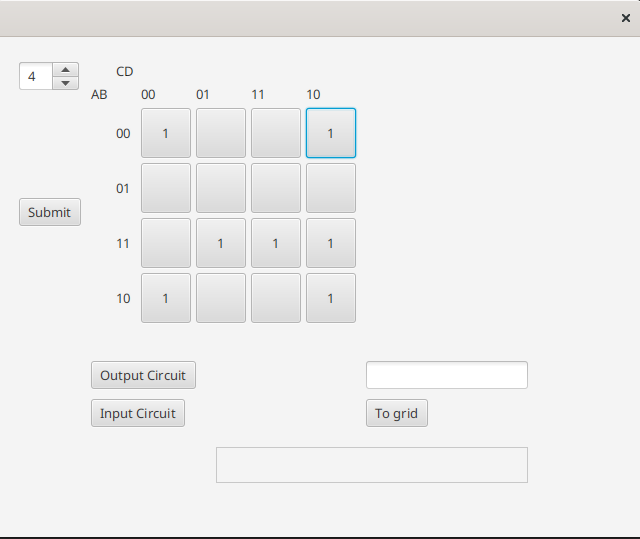
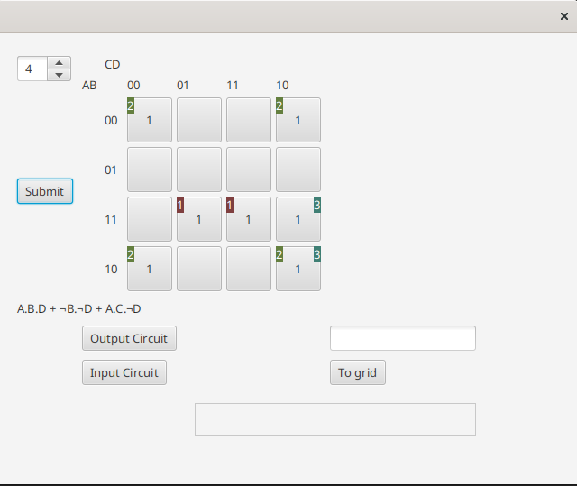
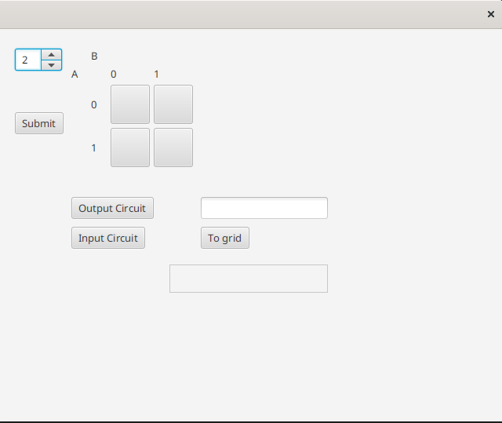
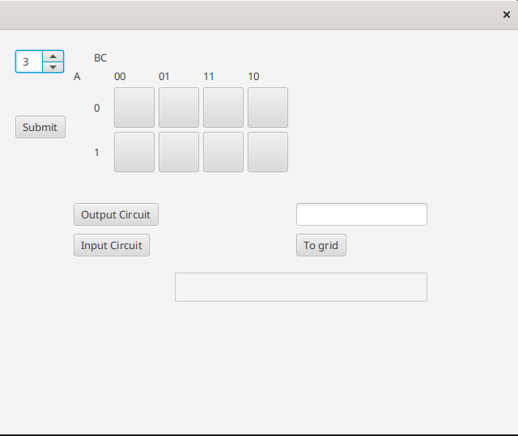
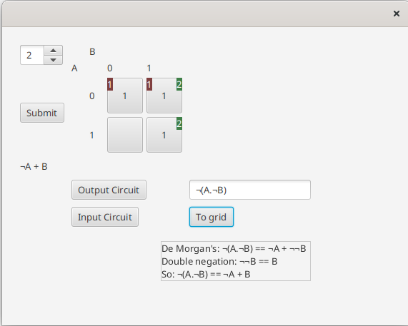
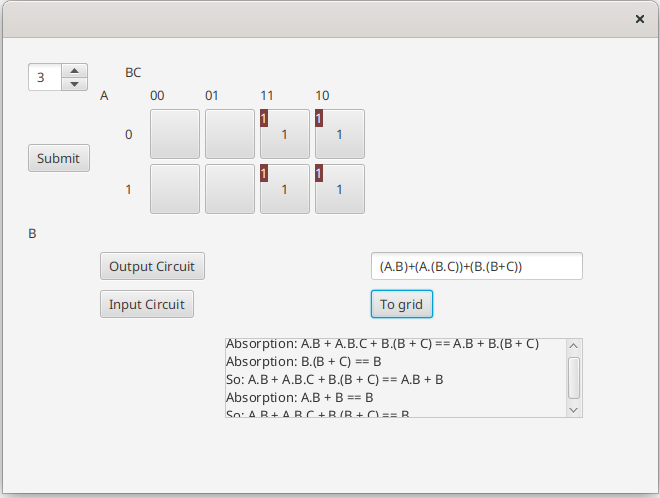
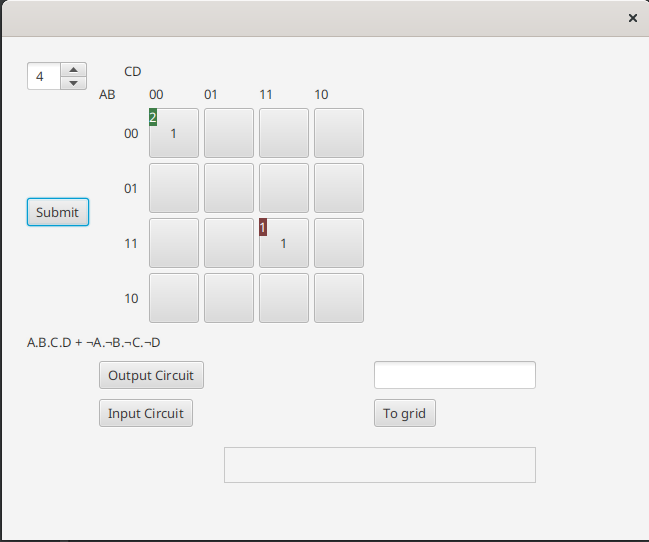
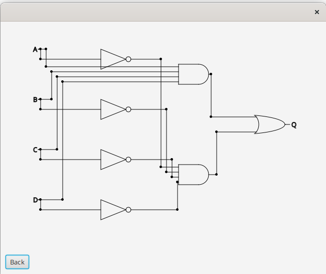
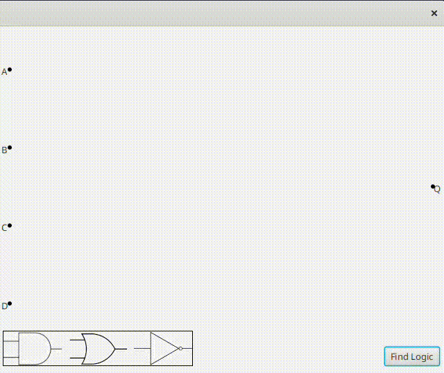

# KarnaughMap

## Basic features
This is an application created in JavaFX, designed to have a variety of functionality related to Boolean algebra.
Its main feature is allowing the user to enter data into a Karnaugh map and then to simplify it - however, it has
a variety of other features, such as outputting an equivalent circuit

Entering values into the Karnaugh map:

Pressing "submit":

As you can see, the app detects the Karnaugh map "loops" and uses them to output the equivalent simplified
expression.

It also supports 2 and 3 variable Karnaugh maps (the number of variables can be selected using the spinner in the top left):

    
    

## Boolean algebra

The user can also input an expression into the TextField. The following are two examples of that:

    
    

As you can see, pressing "To grid" results in the expression being parsed and used to fill the Karnaugh map, which is
then simplified. Additionally, an alternative method of simplification is provided, where it is simplified using the
rules of Boolean algebra.

## Output circuit

The app can also output a circuit equivalent to the inputted expression.

Entering an expression:

Pressing "output circuit"

## Input circuit

The final feature is providing a circuit editor, allowing the user to enter a circuit of their choice. It is then used
to construct the Karnaugh map and the simplified Boolean expression.

Another example:

As you can see, after submitting the input circuit, pressing "input circuit" again results in the previous input circuit
being shown. The user can then modify, as logic gates can be deleted by clicking on them and new ones can also be added.